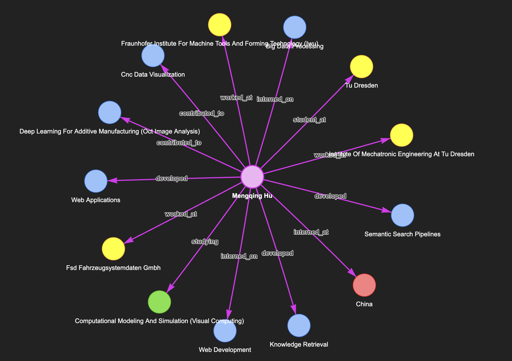
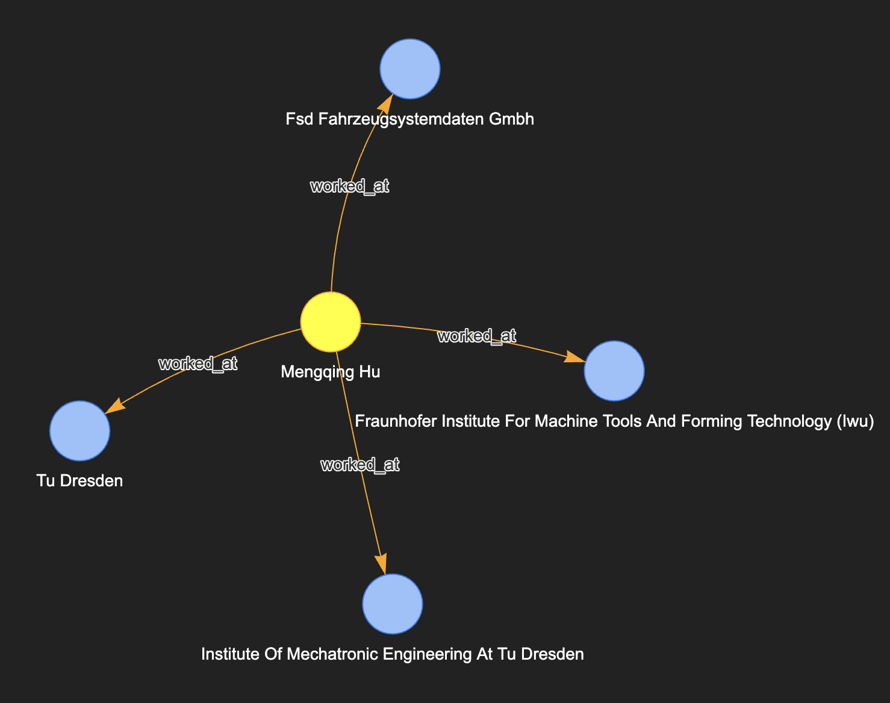
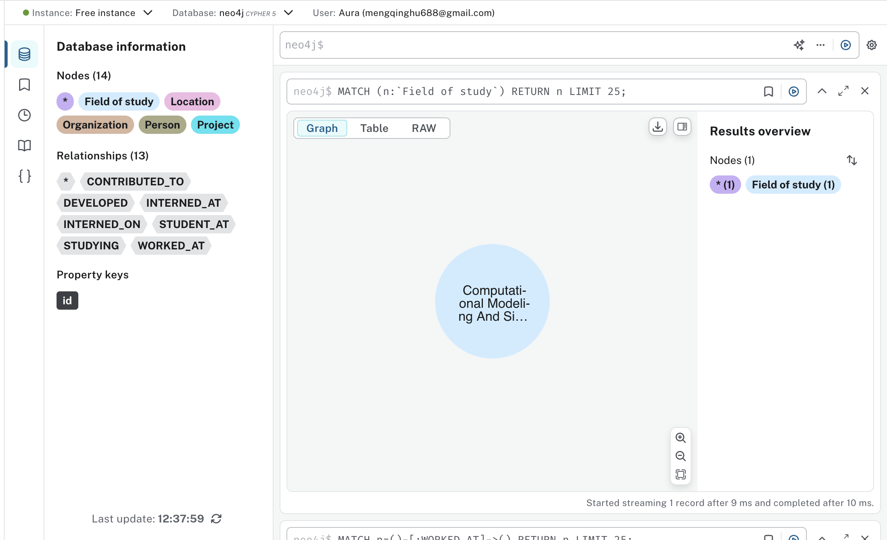
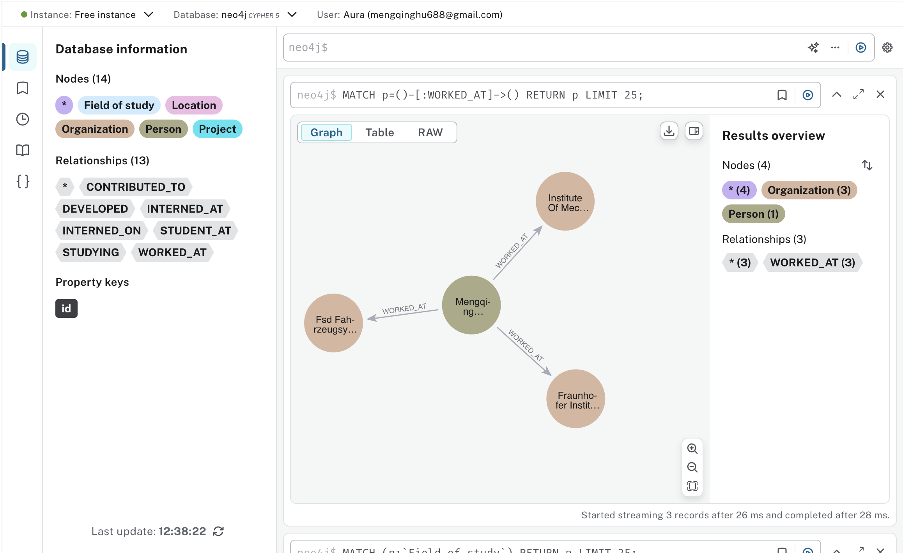

Reference video: [Knowledge Graphs in one Video! It is Trending by Why?? Eveything you need to know! With Code!](https://www.youtube.com/watch?v=xu74BS2UC2Q)

### [How to construct knowledge graphs](https://python.langchain.com/docs/how_to/graph_constructing/)

1. Extracting structured information from text: Model is used to extract structured graph information from text.
2. Storing into graph database: Storing the extracted structured graph information into a graph database enables downstream RAG applications

#### LLM Graph Transformer

Extracting graph data from text enables the transformation of **unstructured information** into **structured formats**, facilitating deeper insights and more efficient navigation through complex relationships and patterns. The `LLMGraphTransformer` converts **text documents** into **structured graph documents** by leveraging a LLM to parse and categorize entities and their relationships. The selection of the LLM model significantly influences the output by determining the accuracy and nuance of the extracted graph data.

